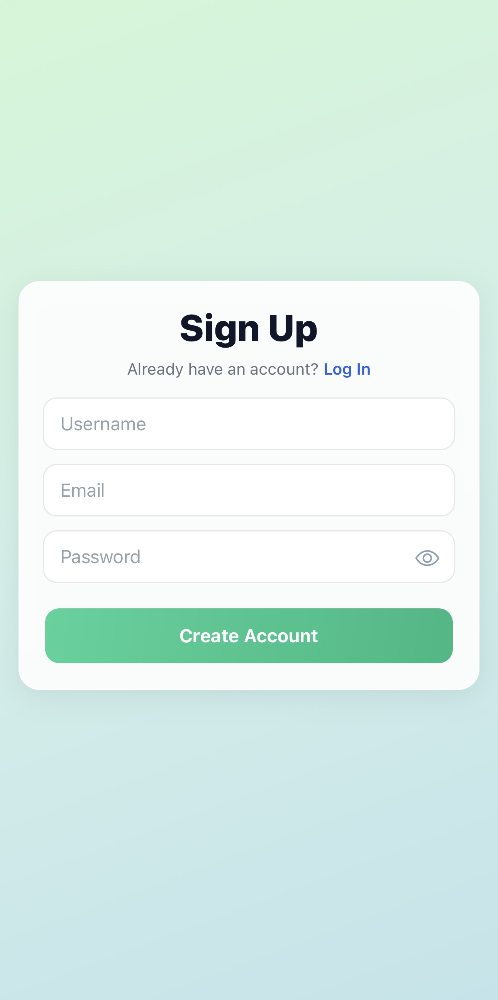
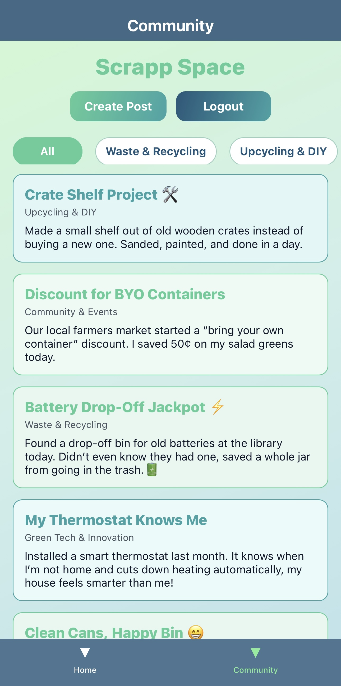
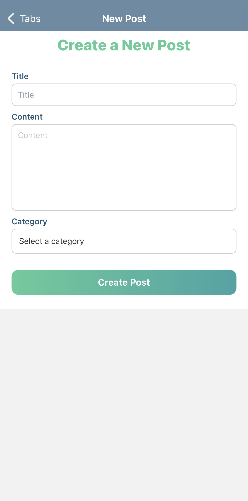

# Scrapp

Scrapp is a is a full-stack mobile + web application that helps users responsibly dispose of trash through AI-powered image classification, and promotes sustainability with a community feed for sharing eco-friendly tips and posts. Users can register/login, take a picture of trash, receive disposal instructions, and connect with others via the community feed.

## Features

- User authentication with token-based login (sign up / sign in / sign out, secure token storage with AsyncStorage)
- Home page with welcome text and button to open the camera
- Camera page to capture trash images, result shows classified label and confidence levels
- Trash classification which detects material type (plastic, glass, paper, etc.) and button to open Gemini-powered chatbot for disposal instructions
- Community feed, view posts from other users in a scrollable list and filter by category, button to create posts

## Tech Stack
- Frontend: React Native + Expo (AsyncStorage, Axios)
- Backend: Django REST Framework, CORS  
- Database: MySQL  
- AI Model: TensorFlow Lite  
- External API: Google Gemini for disposal intructions

## App Screens

  
  
  
  

  
  
  
  

